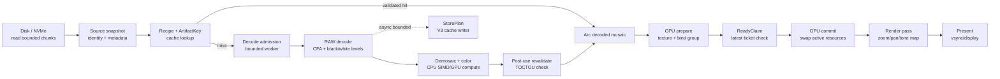

# RAW display pipeline: disk → display

Схема описывает путь полноценного CR2/DNG, а не встроенного JPEG-preview.
Времена — ориентиры для 52 MP RAW на M4 Max, NVMe, Metal, тёплом OS page
cache. Для холодного диска измеряются отдельно.

| Блок | Действие | Параллелизм | Ориентир времени | Что измеряем |
|---|---|---|---:|---|
| 1. Disk read | Последовательное чтение RAW чанками с bounded буфером | I/O worker; prefetch отдельным low-priority worker | NVMe: 5–40 ms; cold storage отдельно | `io_read`, bytes, queue wait |
| 2. Source snapshot | Metadata, stable locator, один проход SourceId; в Epic 3 legacy path-reopen | CPU; identity memoized per session | ~54 ms p95 на 64 MiB full hash | `identity`, source size, mutation flag |
| 3. Recipe/key | Canonical recipe → `RecipeId` → `ArtifactKey` | CPU, no blocking I/O | 211 ns / 312 ns p95 | key derivation only |
| 4. Cache lookup | RAM → V3 → recipe-gated V2; bounded validation before allocation | Cache worker; no decode lease | warm local hit target <10 ms | lookup, deserialize, provenance |
| 5. Decode admission | Reserve CPU/RAM budget and choose foreground/prefetch priority | Single mutex state; lease only around decoder | <1 ms target; cancellation-aware | admission wait, active bytes |
| 6. RAW decode | Parse CR2/DNG, unpack CFA, black/white normalization | Tile-parallel CPU; decoder may use SIMD | 40–180 ms depending camera/size | decode CPU, tiles, worker count |
| 7. Demosaic/color | CFA interpolation, WB, matrix, tone preparation | GPU compute preferred; CPU SIMD fallback | 10–60 ms | compute dispatch + synchronization |
| 8. Revalidate | Verify source unchanged after decode | CPU metadata/handle check | <1 ms warm; mutation suppresses Ready/store | revalidate result |
| 9. GPU prepare | Upload staging data; create texture/bind group/uniform candidate | GPU queue; candidate is not active yet | 5–35 ms; overlaps UI scheduling | upload + allocation |
| 10. ReadyClaim | Check latest request ticket and mailbox liveness | Short mutex critical section | <50 µs p95 | claim accepted/rejected |
| 11. GPU commit | Atomically swap active texture/bind group; old resources released later | Render thread, no blocking disk | <1 ms CPU; GPU completion async | commit, stale candidate count |
| 12. Render/present | Vertex pass, zoom/pan, tone map, vsync | GPU render loop | 0.5–4 ms; 16.7 ms frame budget at 60 Hz | GPU timestamp, missed deadline |
| 13. StorePlan | Stream RRMPAY/V3 payload and digest to cache | Separate bounded writer; never blocks Ready | 50–150 ms for ~100 MiB, asynchronous | persistence latency/bytes |

## Как читать latency

`first_visible` — от принятия запроса до первого committed GPU frame. Оно не
равно сумме всех p95: decode, GPU prepare и I/O частично перекрываются, а
cache-hit вообще пропускает decode. Поэтому JSONL хранит span каждого блока и
отдельно wall-clock `first_visible`.

Целевые режимы:

- **Warm hit:** disk/source identity memoized → cache lookup → GPU prepare →
  commit; целевой first-visible 20–60 ms.
- **Cold miss:** disk → identity → decode → demosaic → GPU; целевой диапазон
  100–300 ms для 52 MP, зависящий от модели камеры.
- **Prefetch promotion:** выбранный кадр переиспользует готовый producer и
  `Arc<DecodedMosaic>`; повторный RAW decode запрещён.

Каждый прогон фиксирует RAW fixture digest, модель камеры, рецепт, размеры,
worker count, tile size, cache state, RSS high-water и resident GPU bytes.
Встроенный JPEG-preview, смешанные CR2/DNG и разные профили декодера в одном
сравнении запрещены.
