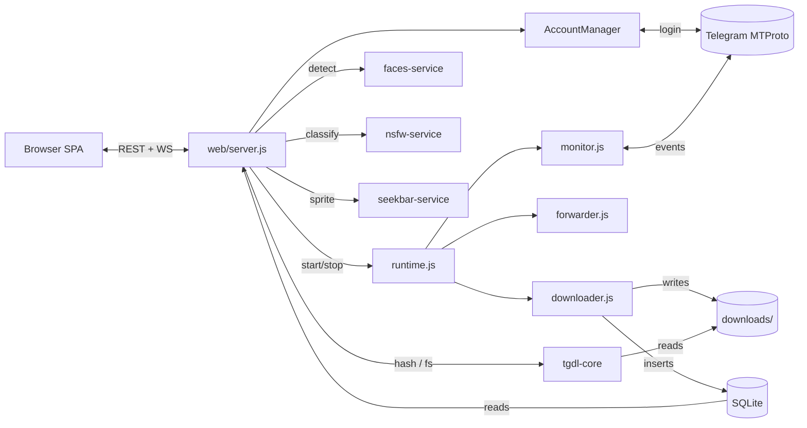

<p align="center">
  <a href="https://github.com/botnick/telegram-media-downloader/releases/latest"></a>
  
  
  <a href="https://github.com/botnick/telegram-media-downloader/pkgs/container/telegram-media-downloader"></a>
  <a href="https://github.com/botnick/telegram-media-downloader/actions/workflows/ci.yml"></a>
</p>

<h1 align="center">Telegram Media Downloader</h1>

<p align="center">
  <b>A self-hosted Telegram media downloader with a web dashboard.</b><br>
  Download Telegram channel and group media, or back up any chat you belong to — photos, videos, documents,<br>
  voice messages, GIFs, stickers and Stories — with your own account. Runs in Docker or on Node.js. No bot, no cloud.
</p>

<p align="center">
  <a href="#quick-start">Quick Start</a> &bull;
  <a href="#faq">FAQ</a> &bull;
  <a href="#features">Features</a> &bull;
  <a href="#dashboard-preview">Dashboard</a> &bull;
  <a href="docs/CLUSTER.md">Cluster</a> &bull;
  <a href="docs/AI.md">AI Faces</a> &bull;
  <a href="docs/API.md">API</a> &bull;
  <a href="docs/DEPLOY.md">Deploy</a> &bull;
  <a href="docs/README.md">All docs</a>
</p>

<p align="center">
  <picture>
    <source media="(prefers-color-scheme: light)" srcset="docs/screenshots/library-light.webp">
    
  </picture>
</p>

---

## Why this tool?

| Problem | Solution |
|---------|----------|
| Telegram bot API caps files at 50 MB / 4 GB | **User API (MTProto)** — no file size limits |
| No way to bulk-archive a channel | **One-click backfill** with date/count filters |
| Self-destructing media disappears | **TTL capture** — priority-queued before expiry |
| Private channels need special access | **Your account** can read it = this tool can download it |
| No easy way to share downloads | **Signed share links** — no login needed, revocable |
| Scattered across devices | **Web dashboard** — access from any browser on your network |

---

## Dashboard Preview

<table>
  <tr>
    <td width="50%"></td>
    <td width="50%"></td>
  </tr>
  <tr>
    <td align="center"><b>Chats</b> — monitor channels, groups and DMs; backfill history</td>
    <td align="center"><b>Chat details</b> — what to download, forwarding, storage, in one page</td>
  </tr>
  <tr>
    <td></td>
    <td></td>
  </tr>
  <tr>
    <td align="center"><b>Queue</b> — live progress, speed, ETA; pause, retry or cancel any file</td>
    <td align="center"><b>Ctrl+K</b> — jump to any page, tool, setting or chat</td>
  </tr>
  <tr>
    <td></td>
    <td></td>
  </tr>
  <tr>
    <td align="center"><b>Viewer</b> — swipe / arrow keys, pin, share link, download</td>
    <td align="center"><b>Tools</b> — duplicates, thumbnails, NSFW review, AI faces, backups, cluster</td>
  </tr>
</table>

<p align="center">
  
  
  
  
</p>
<p align="center"><sub>Installable as a PWA — the same dashboard on a phone, in dark or light theme. Screenshots use generated demo images and fictional chat names.</sub></p>

---

## Quick Start

### Docker (recommended, about 60 seconds)

Needs Docker with Compose and a Telegram `apiId` / `apiHash` from [my.telegram.org](https://my.telegram.org).

```bash
git clone https://github.com/botnick/telegram-media-downloader.git
cd telegram-media-downloader
docker compose up -d
```

Open `http://localhost:3000` and follow the setup wizard:

1. **Set password** (first run only)
2. **Settings > Telegram API** — paste `apiId` + `apiHash` from [my.telegram.org](https://my.telegram.org)
3. **Settings > Accounts > Add** — phone, OTP, optional 2FA
4. **Start monitor** — or paste a `t.me/` link to download a single message

### One-click cloud deploy

| Provider | |
|----------|---|
| **Render** | [](https://render.com/deploy?repo=https://github.com/botnick/telegram-media-downloader) |
| **Railway** | [](https://railway.app/template/?template=https://github.com/botnick/telegram-media-downloader) |

### Node.js (bare metal)

```bash
git clone https://github.com/botnick/telegram-media-downloader.git
cd telegram-media-downloader
npm ci && npm start
```

---

## Features

### Core Engine

- **Realtime monitor** — watches unlimited channels, groups, supergroups, and forum topics
- **Monitor resumes last state** — auto-starts on boot if it was running before shutdown
- **Bulk backfill** — archive thousands of past messages with date/count filters
- **Multi-account** — unlimited Telegram accounts with per-group routing
- **Dual-lane queue** — realtime downloads never starve behind backfill
- **TTL capture** — self-destructing media priority-queued before expiry
- **Smart dedup** — SHA-256 at download time + on-demand library scan
- **Auto-forward** — relay downloads to another chat or Saved Messages
- **Integrity sweep** — hourly scan re-queues missing files, prunes orphans
- **Disk rotation** — auto-prune oldest files when size limit exceeded

### Web Dashboard

- **Telegram-themed SPA** — responsive, installable PWA, works offline
- **Gallery** — grid/compact/list views, lazy-load thumbnails, type filters, search
- **Queue** — IDM-style per-file progress, pause/resume/cancel/retry, NSFW blocklist badges
- **Video player** — scrub, seekbar hover preview, PiP, keyboard shortcuts
- **Share links** — HMAC-signed URLs with TTL, revocable, no login required
- **Bilingual** — English + Thai, runtime switchable

### AI & Media Intelligence

| Feature | Backend | Description |
|---------|---------|-------------|
| **Face clustering** | Python sidecar (insightface) + tgdl-core (DBSCAN) | Detect and group faces from photos and videos. GPU-accelerated. Local or [remote sidecar](#external-ai-sidecar). |
| **Seekbar previews** | Go sidecar (ffmpeg) | Netflix-style hover thumbnails on the video scrub bar. Local or [remote sidecar](#external-ai-sidecar). |
| **NSFW detection** | HuggingFace WASM or remote sidecar | Local CPU classifier with review UI and whitelist, or offload to a [remote GPU](#external-ai-sidecar) |
| **Duplicate finder** | SHA-256 + GROUP BY | Full-library scan with bulk delete |

### Backup & Sync

- **5 backup providers** — S3 / R2 / B2 / Wasabi, SFTP, Google Drive, Dropbox, local mount
- **Client-side encryption** — optional AES-256-GCM per destination
- **Cluster mode** — federate multiple dashboards into one library with real-time sync, automatic failover, LAN auto-discovery

### Security

- **Fail-closed** — no password = no access
- **scrypt password hashing** with `timingSafeEqual` verification
- **httpOnly + sameSite=strict** session cookies
- **Default-deny API** — guest role is read-only, mutations are admin-only
- **Rate-limited login** — 10 attempts / 15 min / IP
- **Symlink/traversal proof** file serving via `fs.realpath`
- **CodeQL + Dependabot** scheduled scans

---

## Architecture



The app is a Node.js server (Express, SQLite, gramJS) plus **tgdl-core**, a required Go binary, and three optional sidecars.

- **tgdl-core** (Go, required): hashing, integrity checks, folder walks and face clustering (DBSCAN). It is also the front server on `PORT`: it serves every media byte (`/files`, photos, thumbnails, Range requests) and proxies everything else to Node. `npm install` downloads it (checksum-verified) or builds it; the Docker image includes it.
- **faces-service** (Python): face detection and embeddings.
- **nsfw-service** (Python): NSFW classification.
- **seekbar-service** (Go): video hover previews.

Each sidecar runs locally or as an External one on another machine (see [External AI Sidecar](#external-ai-sidecar)); when one is missing or fails, its feature falls back to the built-in code or stays off. Details: [Architecture](docs/ARCHITECTURE.md), [tgdl-core](docs/GO-CORE.md) and the [Go migration plan](docs/GO-MIGRATION.md).

---

## Supported File Types

Photos (JPEG, PNG, WebP, BMP) / Videos (MP4, MKV, AVI, MOV, WebM) / Audio (MP3, M4A, FLAC, WAV, OGG, voice) / Documents (PDF, ZIP, any MIME) / GIFs / Stickers (WebP, TGS) / URL extraction

---

## Configuration

All config lives in SQLite (`kv['config']`), editable from the dashboard. Legacy JSON files are auto-imported on first boot.

<details>
<summary>Full config reference</summary>

```jsonc
{
  "telegram":   { "apiId": "...", "apiHash": "..." },
  "accounts":   [/* populated by wizard */],
  "groups":     [/* {id, name, enabled, filters, autoForward, monitorAccount} */],
  "monitor":    { "autoStart": true },
  "download":   { "concurrent": 5, "retries": 5, "maxSpeed": 0 },
  "rateLimits": { "requestsPerMinute": 15 },
  "diskManagement": { "maxTotalSize": "50GB" },
  "proxy":      { "type": "socks5", "host": "...", "port": 1080 },
  "advanced": {
    "ai":       { "enabled": false, "faces": { "detectorModel": "buffalo_l" } },
    "seekbar":  { "enabled": false, "autoOnDownload": false },
    "nsfw":     { "enabled": false, "threshold": 0.6 },
    "thumbs":   { "autoOnDownload": true }
  }
}
```

</details>

<details>
<summary>Environment variables</summary>

| Variable | Default | Description |
|----------|---------|-------------|
| `TGDL_PORT` | `3000` | Dashboard port (host side in the compose file) |
| `TGDL_DATA_DIR` | `./data` | Base data directory |
| `TGDL_DOWNLOADS_DIR` | _(unset)_ | Split downloads onto separate disk |
| `TGDL_DEBUG` | _(unset)_ | `1` = verbose logging |
| `FFMPEG_HWACCEL` | _(empty)_ | `cuda` / `vaapi` / `qsv` / `videotoolbox` |
| `WATCHTOWER_HTTP_API_TOKEN` | _(auto-generated)_ | Optional override for the Install-update sidecar token |
| `FACES_SERVICE_URL` | `http://tgdl-faces:8011` | Face clustering sidecar |
| `TGDL_NSFW_SIDECAR_URL` | _(unset)_ | External NSFW classifier URL |
| `SEEKBAR_SIDECAR_URL` | _(unset)_ | Seekbar sidecar URL |

Full env-var reference in [docs/DEPLOY.md](docs/DEPLOY.md#environment-variables) and [docs/AI.md](docs/AI.md).

</details>

---

## Updating

- **In the app:** Settings → Maintenance → **Install update** (Docker; no setup, token is auto-generated).
- **Manually:** `docker compose pull && docker compose up -d`

New versions need no config changes; migrations run automatically. Existing users: re-download `docker-compose.yml` once so the button works without a profile. Details in [docs/DEPLOY.md](docs/DEPLOY.md#updating).

---

## Docker Compose profiles

```bash
# Base (dashboard, tgdl-core and the idle update sidecar)
docker compose up -d

# + AI face clustering (CPU)
docker compose --profile faces up -d

# + AI face clustering (NVIDIA GPU)
docker compose --profile faces-cuda up -d
```

---

## External AI Sidecar

Offload face detection and NSFW classification to a remote GPU server — ideal when the main dashboard runs on a CPU-only machine.

**Setup (GPU server):**

```bash
# Face detection (already included in the repo)
cd faces-service && pip install -r requirements.txt && python -m tgdl_faces

# NSFW classification
cd nsfw-service && pip install -r requirements.txt && python main.py
```

Expose via Cloudflare Tunnel or any reverse proxy, then paste the URLs in **Maintenance > AI > System Health** (faces) and **Maintenance > NSFW** (classifier). Both fall back to local processing when no URL is set.

| Service | Default Port | Env Override | Config Key |
|---------|-------------|-------------|------------|
| Face detection | 8011 | `FACES_SERVICE_URL` | `advanced.ai.faces.sidecarUrl` |
| NSFW classifier | 8012 | `TGDL_NSFW_SIDECAR_URL` | `advanced.nsfw.sidecarUrl` |
| Seekbar previews | 8089 | `SEEKBAR_SIDECAR_URL` | `advanced.seekbar.sidecarUrl` |

---

## CLI Commands

| Command | Description |
|---------|-------------|
| `npm start` | Dashboard at `http://localhost:3000` |
| `npm run dev` | Dashboard with auto-restart on edits |
| `npm run monitor` | Headless realtime monitor (no UI) |
| `npm run history` | Bulk backfill from terminal |
| `npm run doctor` | Diagnostics (Node, SQLite, ffmpeg, sidecars) |
| `npm run auth` | Reset dashboard password |
| `npm test` | Run the vitest suite |

---

## File Layout

```
data/
├── db.sqlite               # config + downloads + faces + sessions (WAL mode)
├── secret.key              # BACK THIS UP — decrypts all sessions
├── sessions/<id>.enc       # AES-256-GCM encrypted Telegram sessions
├── downloads/<group>/      # organized by chat and media type
├── thumbs/                 # server-generated WebP thumbnails
├── seekbar/                # video sprite sheets + metadata
├── backups/                # pre-update DB snapshots
└── logs/                   # rotated at 5 MB
```

---

## FAQ

### How do I download all media from a Telegram channel?

Add your Telegram account (Settings > Accounts), open **Chats**, pick the channel and start a **backfill**. You can limit it by date or message count. The dashboard then shows every file in the queue with progress, speed and ETA. To keep the archive current, enable the realtime monitor for that chat.

### Can it download from private channels and groups?

Yes, if the Telegram account you sign in with is a member. The tool acts as that account over the Telegram user API (MTProto), so it reads what you can read in the Telegram app.

### How is this different from a Telegram bot?

Bots use the Bot API, which limits file sizes and only sees chats the bot was added to. This tool logs in as your user account through MTProto, so it has no bot-style file-size cap and sees your own chats.

### Is my Telegram session safe?

Sessions are encrypted at rest (AES-256-GCM) in `data/sessions/`, with the key in `data/secret.key`. Nothing is sent to a cloud service run by this project. The dashboard fails closed: without a password nobody gets in. Put it behind HTTPS if you expose it, and back up `secret.key` (losing it makes saved sessions unrecoverable). See [SECURITY.md](SECURITY.md).

### Will my account get banned?

Built-in rate limiting (default 15 requests per minute) and FloodWait handling keep traffic modest. Avoid lowering the limits aggressively or running many accounts from one IP. No tool can promise zero risk.

### Does it run on a Raspberry Pi or a Synology NAS?

Yes on Synology (the repo ships `docker-compose.synology.yml`). The published Docker image targets linux/amd64; on ARM boards such as a Raspberry Pi, run it from source with Node.js 22+ (`npm ci && npm start`), because tgdl-core has ARMv7 and arm64 Linux builds that `npm install` fetches for you. See [Deploy](docs/DEPLOY.md) for Synology notes and low-power tuning.

### Can I download Stories or self-destructing media?

Yes to both. Stories are fetched from the Stories button by username. Self-destructing (TTL) media is detected and moved to the front of the queue before it expires.

### How do I download a single message or a t.me link?

Paste the `t.me/...` link into the dashboard's link drawer. Channel, group, forum-topic and private links are supported.

### How do I update it?

In Docker, use **Settings > Maintenance > Install update** or run `docker compose pull && docker compose up -d`. See [Updating](#updating).

### Where are the files stored, and can I back them up?

Downloads live under `data/downloads/<chat>/` (or `TGDL_DOWNLOADS_DIR` on another disk). Optional backups go to S3-compatible storage, SFTP, Google Drive, Dropbox or a local mount, with client-side encryption. See [Backup](docs/BACKUP.md).

---

## Documentation

| Document | Description |
|----------|-------------|
| [Deploy](docs/DEPLOY.md) | Docker, bare metal, reverse proxies (Caddy, nginx, Traefik), env vars |
| [Troubleshooting](docs/TROUBLESHOOTING.md) | Common issues and fixes |
| [Architecture](docs/ARCHITECTURE.md) | How the pieces fit together |
| [tgdl-core](docs/GO-CORE.md) | The Go engine and front server |
| [Go migration plan](docs/GO-MIGRATION.md) | Roadmap for a pure-Go backend |
| [AI: faces and NSFW](docs/AI.md) | Sidecars, GPU, external hosts |
| [Backup](docs/BACKUP.md) | S3, SFTP, FTP, Google Drive, Dropbox, local |
| [Cluster mode](docs/CLUSTER.md) | Multi-machine federated library |
| [API reference](docs/API.md) | HTTP + WebSocket endpoints |
| [Changelog](CHANGELOG.md) | Release notes |

The same docs are published as a searchable site from `/docs` via GitHub Pages, and [`llms.txt`](llms.txt) gives AI assistants a curated index.

----------|-------------|
| [Architecture](docs/ARCHITECTURE.md) | System design deep-dive |
| [API Reference](docs/API.md) | HTTP + WebSocket endpoints |
| [Cluster Mode](docs/CLUSTER.md) | Multi-machine federated library |
| [AI Face Clustering](docs/AI.md) | insightface setup, GPU, models |
| [Backup Providers](docs/BACKUP.md) | S3, SFTP, GDrive, Dropbox |
| [Deploy](docs/DEPLOY.md) | Reverse proxy recipes (Caddy, nginx, Traefik) |
| [Troubleshooting](docs/TROUBLESHOOTING.md) | Common issues and fixes |

---

## Contributing

```bash
npm ci
npm run build:core     # optional: build tgdl-core from source (needs Go)
npm run lint           # biome lint
npm test               # vitest specs
npm run test:contract  # API contract suite
```

See [CONTRIBUTING.md](CONTRIBUTING.md) for conventions.

---

## License

[MIT](LICENSE) — free for personal and commercial use.

Not affiliated with Telegram. Uses the public MTProto User API via [GramJS](https://github.com/gram-js/gramjs).

